  

  

Final-year B.Tech CS (Data Science) student building end-to-end ML and analytics solutions — from graph neural networks for anomaly detection to financial risk models.

  

### 🚀 Featured Projects

**🔗 Supply Chain Anomaly Detection — Graph Neural Networks**
Built a custom Graph Attention Network (GAT) in PyTorch to flag anomalies across supply chain networks, achieving a **0.987 ROC-AUC**. Shipped with an interactive Streamlit dashboard for real-time exploration.
`Python` `PyTorch` `GNN` `Streamlit`

**📈 Capital Asset Pricing Model (CAPM) with Machine Learning**
Applied ML techniques to estimate expected returns and asset risk using CAPM, blending financial theory with data-driven modeling.
`Python` `scikit-learn` `Pandas` `Financial Modeling`

---

### 👨‍💻 Currently Working On
- Data analysis & visualization projects using **Python, SQL, Power BI, and Excel**
- Applying Applied AI / Data Science skills from internships at **IBM SkillBuild** and **Happieloop**
- Building analytical models focused on **business and financial insights**

### 🤝 Open to Collaborating On
- Data analytics projects (EDA, dashboards, reporting)
- Machine learning–based analytical projects
- Business intelligence & data visualization use cases
- Open-source or academic projects in data-driven decision making

### 🎯 Career Focus
Roles in **data analysis, machine learning engineering, and business insights/reporting**.

---

### 🛠️ Tech Stack

---

### 📊 GitHub Stats

  
  

  

> **Setup required:** these two images are generated by a GitHub Action in this repo, not a live external service. See the setup note at the very bottom of this file.

### 🏆 GitHub Trophies

  

### 📈 Activity Graph

  

### 🐍 Contribution Snake

  

---

### 🌐 Connect With Me

  

